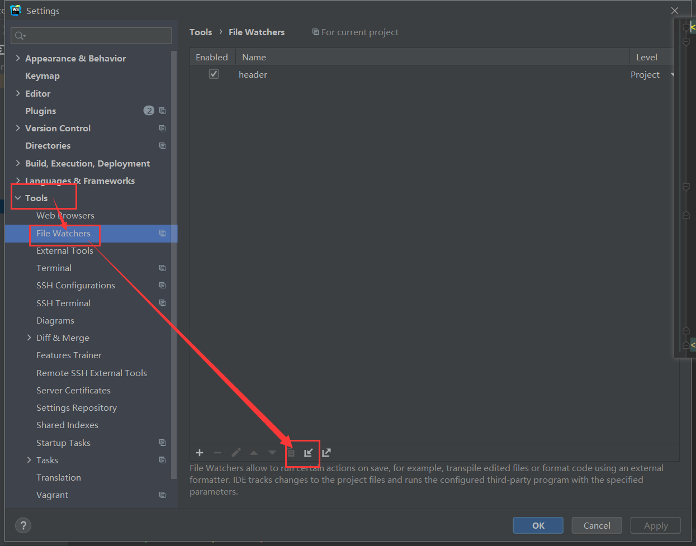

# IDEA/Webstorm 利用file watchers自动生成文件头部注释

- 本插件基于[file-header](https://github.com/CinitSwift/file-header)，添加了节流功能，五秒触发一次
- 恢复原本的代码不会再次更新头部信息
注释示例：

```js
/*
 * @Author: name
 * @Date: 2021-06-10 20:54:26
 * @LastEditors: name
 * @LastEditTime: 2021-06-10 21:09:06
 * @Description: desc
 */
```

效果：js文件修改后，将`@LastEditors: `后面的`name`替换成自己的姓名、`@LastEditTime: `后面的时间替换成当前时间。

目前是判断代码里面是否包含`@LastEditors: `以及`@LastEditTime:`来辨别是否有头部注释。**注释格式可以通过源码来调整，不修改app.js源码就使用的话一定要把注释写成这个格式**

源码格式在27~47行，看着修改一下就好。

系统环境：Nodejs v12+

将项目拉下来以后，**妥善保存**`app.js`！

打开`watchers.xml`，将

```xml
<option name="arguments" value="C:\Users\cinitswift\Desktop\app.js $FileDir$ $FileName$ $FileEncoding$ $FileExt$ name" />
```

app.js中的引入改成绝对路径，例如：
```javascript
const dateFun = require('C:\\Users\\Administrator\\Downloads\\file-header-main\\throttle.js')
```

该项`value`中的路径替换成**你电脑上**`app.js`的**绝对路径**，并把`$FileExt$`后面的`name`替换成**你的姓名**

打开Idea或者webstorm -> File -> Settings -> Tools -> File Watchers，点击import，选择`watchers.xml`导入。



导入后把它勾选上，点击右下角的apply和ok就完事了。

其他的文件例如`vue`或者`java`文件修改`app.js`里面的代码也能做到该类文件头注释的修改。

**最后就是导入`xml`之后一定不要换`app.js`的位置，换了路径的话要把它里面`arguments`里面的路径修改成当前路径**
